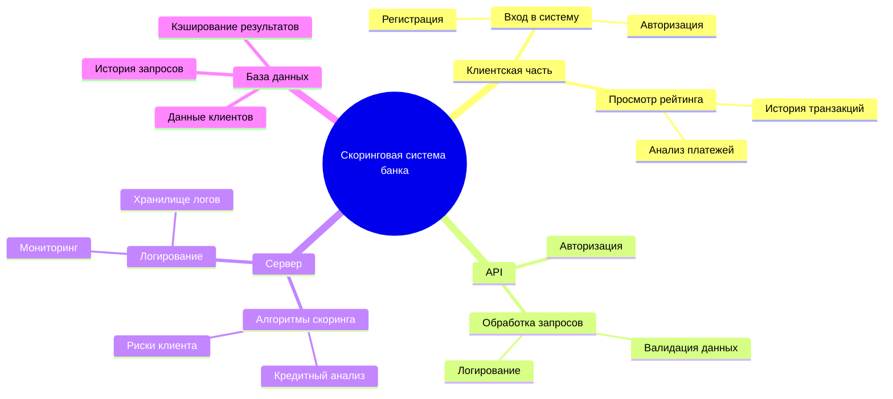
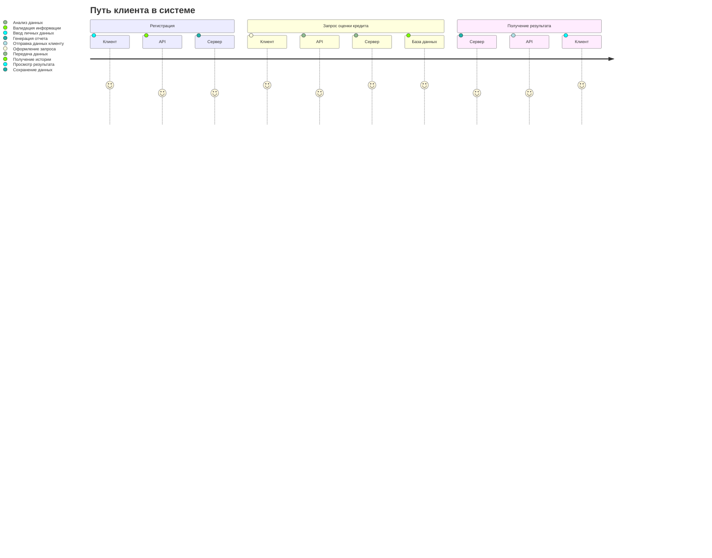
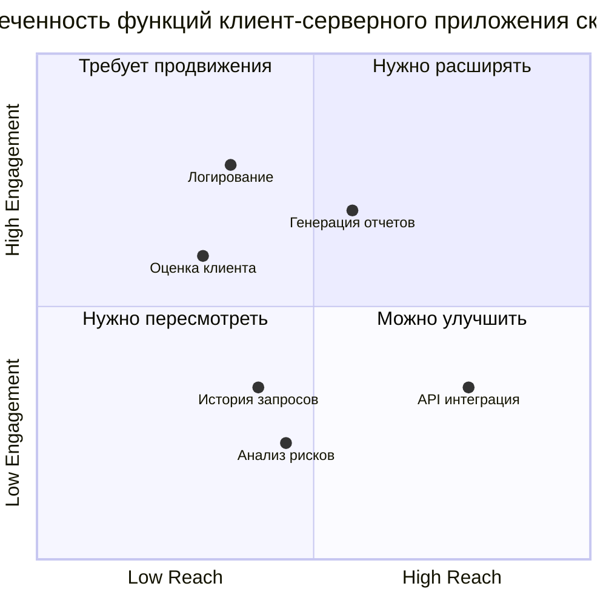
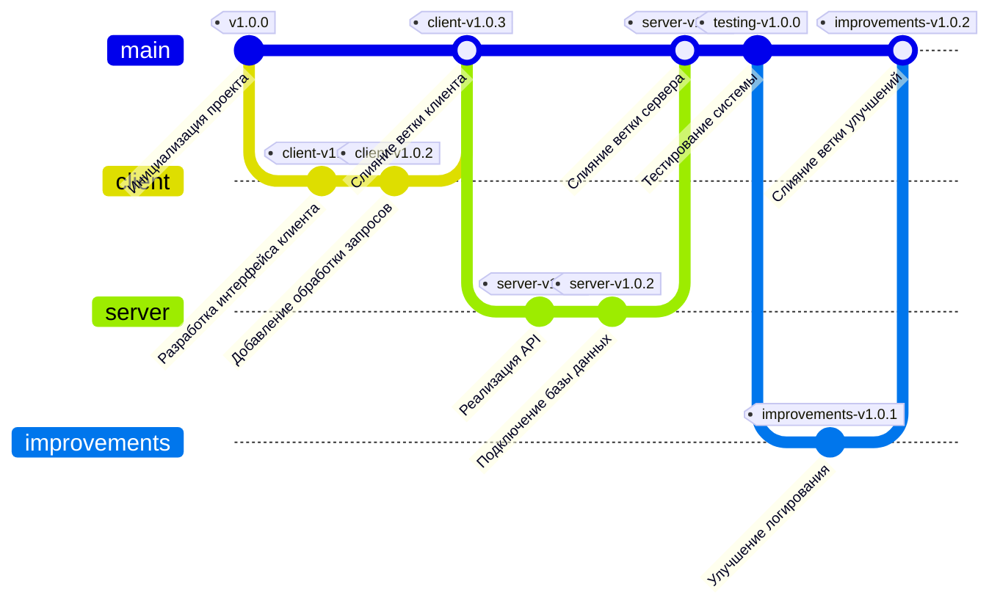

# Клиент-Серверная Система Скоринга Банка
# 1. Mind Map: Функциональные возможности скоринговой системы

### Пояснение диаграммы
Клиентская часть:
1. Клиентская часть:
   - Вход в систему:
     - Регистрация и авторизация пользователей для доступа к системе.
   - Просмотр рейтинга:
     - Возможность просмотра рейтинга, истории транзакций и анализа платежей.

2. API:
   - Авторизация:
     - Проверка данных пользователя для подтверждения личности.
   - Обработка запросов:
     - Валидация данных и логирование запросов для дальнейшего анализа.

3. Сервер:
   - Алгоритмы скоринга:
     - Использование алгоритмов для оценки кредитоспособности и анализа рисков.
   - Логирование:
     - Мониторинг системы и хранение логов для анализа работы приложения.

4. База данных:
   - Хранение данных клиентов, истории запросов и кэширование результатов для быстрого доступа.

# 2. Диаграмму путешествия пользователя (User Journey Diagram)

### Пояснение диаграммы
Регистрация:
1. Регистрация:
   - Клиент вводит личные данные для регистрации в системе.
   - API проверяет корректность данных.
   - Сервер сохраняет данные клиента в системе.

2. Запрос оценки кредита:
   - Клиент отправляет запрос на оценку кредитоспособности.
   - API передает данные на сервер для анализа.
   - Сервер анализирует данные и оценивает кредитоспособность.
   - База данных предоставляет историю транзакций клиента для улучшения точности анализа.

3. Получение результата:
   - Сервер генерирует отчет по результатам оценки.
   - API отправляет отчет клиенту.
   - Клиент получает результат и принимает решение по заявке.

# 3. Квадрант-граф приоритетов функционала

### Пояснение диаграммы
Охват и вовлеченность:
1. Охват и вовлеченность:
   - Диаграмма помогает оценить функции по охвату и вовлеченности.
   - Квадрант 1 (Нужно расширять): Функции, которые следует развивать для повышения охвата и вовлеченности.
   - Квадрант 2 (Требует продвижения): Функции, которые нуждаются в дополнительном продвижении.
   - Квадрант 3 (Нужно пересмотреть): Функции, которые требуют доработки или пересмотра.
   - Квадрант 4 (Можно улучшить): Функции, которые можно улучшить, но не требуют существенных изменений.

2. Функции:
   - Оценка клиента: Оценка кредитоспособности клиентов.
   - Анализ рисков: Оценка рисков для предоставления кредита.
   - Генерация отчетов: Создание отчетов для пользователей и администраторов.
   - API интеграция: Интеграция с внешними системами для получения или передачи данных.
   - История запросов: Просмотр истории запросов клиента для анализа.
   - Логирование: Система логирования для мониторинга и анализа работы.

# 4. Гит граф (Gitgraph)

### Пояснение диаграммы
1. Процесс разработки:
   - Инициализация проекта: Начало разработки проекта, создание основной структуры и начального тега.
   - Разработка интерфейса клиента: Создание интерфейса для взаимодействия с пользователем.
   - Добавление обработки запросов: Реализация функционала для обработки запросов от клиента.
   - Реализация API: Создание API для интеграции с внешними системами.
   - Подключение базы данных: Интеграция базы данных для хранения и обработки данных клиента.
   - Тестирование системы: Проверка работы системы перед финальной версией.
   
2. Слияние веток:
   - Каждая ветка (клиентская, серверная, улучшения) сливается с основной веткой (`main`), и с каждым слиянием добавляется новый тег.
