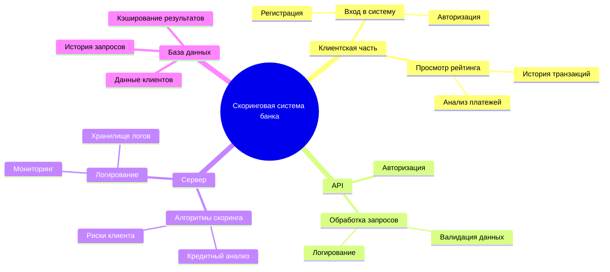
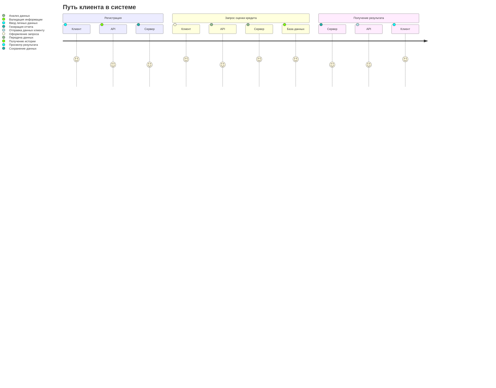

# Mind Map: Функциональные возможности скоринговой системы



# 3. Диаграмму путешествия пользователя (User Journey Diagram)

# 4. Квадрант-граф приоритетов функционала
```mermaid
quadrantChart
    title Functional Development Priorities
    x-axis Priority
    y-axis Complexity
    "Implement Immediately": [ ["Risk Analysis", 85, 95], ["API Integration", 75, 85], ["Scoring Reports", 70, 90] ]
    "Needs Thorough Analysis": [ ["Error Handling", 65, 60], ["Authorization and Security", 55, 50] ]
    "Plan for Near Future": [ ["Query History", 45, 80], ["Support Chat", 40, 75] ]
    "Might Be Dropped": [ ["Email Notifications", 20, 30], ["Recommendations", 15, 25] ]

```
# 4. Гит граф (Gitgraph)

