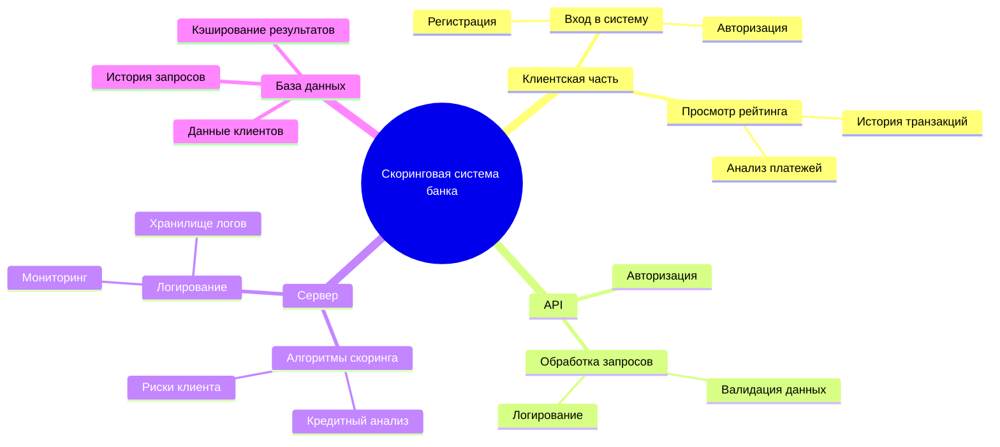
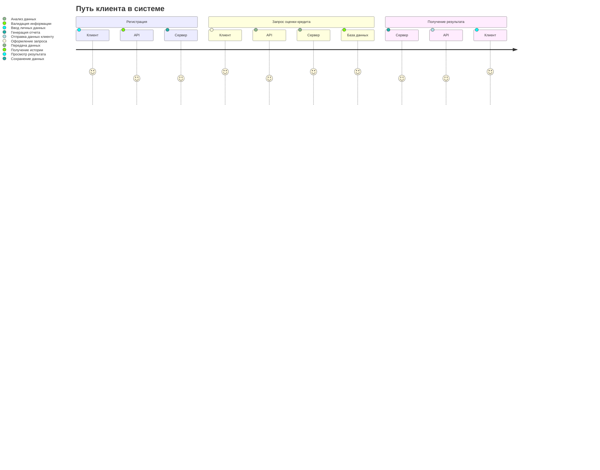

# Mind Map: Функциональные возможности скоринговой системы



# 3. Диаграмму путешествия пользователя (User Journey Diagram)

# 4. Квадрант-граф приоритетов функционала
```mermaid
scatterChart
    title Functional Development Priorities
    x-axis Low Priority --> High Priority
    y-axis Low Complexity --> High Complexity

    point "Risk Analysis" : 9, 9
    point "API Integration" : 8, 8
    point "Scoring Reports" : 7, 9
    point "Error Handling" : 6, 6
    point "Authorization and Security" : 5, 5
    point "Query History" : 4, 8
    point "Support Chat" : 3, 7
    point "Email Notifications" : 2, 3
    point "Recommendations" : 1, 2


```
# 4. Гит граф (Gitgraph)

