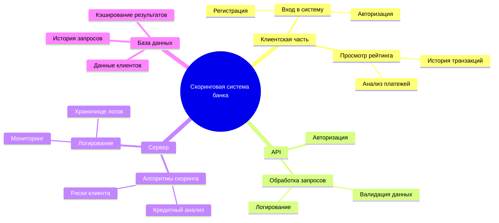
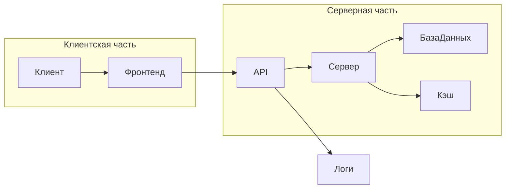
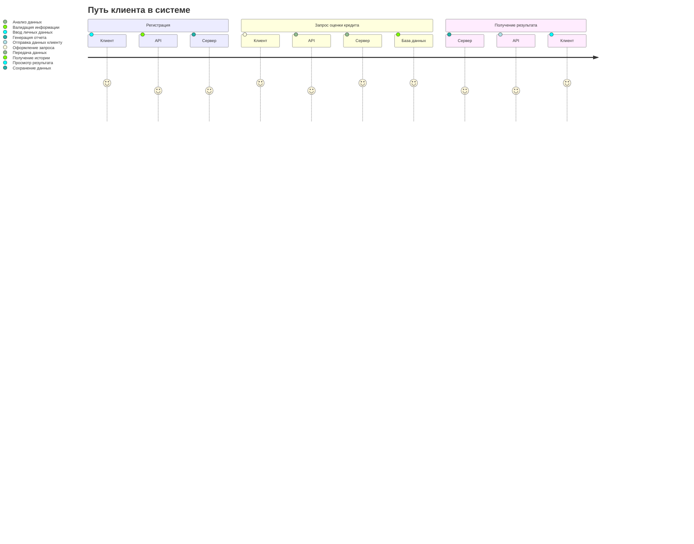
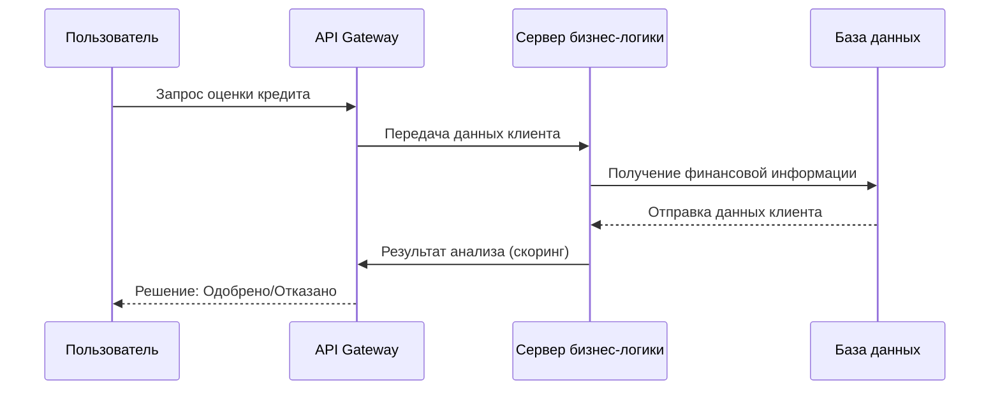

# Mind Map: Функциональные возможности скоринговой системы

```mermaid
mindmap
  root((Скоринговая система банка))
    Клиентская часть
      Вход в систему
        Регистрация
        Авторизация
      Просмотр рейтинга
        История транзакций
        Анализ платежей
    API
      Авторизация
      Обработка запросов
        Валидация данных
        Логирование
    Сервер
      Алгоритмы скоринга
        Кредитный анализ
        Риски клиента
      Логирование
        Мониторинг
        Хранилище логов
    База данных
      Данные клиентов
      История запросов
      Кэширование результатов
```
# 2. Архитектура системы

```mermaid
graph LR
    subgraph Клиентская часть
        Клиент
        Фронтенд
    end
    subgraph Серверная часть
        API
        Сервер
        БазаДанных
        Кэш
    end
    Клиент --> Фронтенд
    Фронтенд --> API
    API --> Сервер
    Сервер --> БазаДанных
    Сервер --> Кэш
    API --> Логи
```
# 3. Диаграмму путешествия пользователя (User Journey Diagram)

```mermaid
journey
    title Путь клиента в системе
    section Регистрация
      Клиент: 5: Ввод личных данных
      API: 4: Валидация информации
      Сервер: 4: Сохранение данных
    section Запрос оценки кредита
      Клиент: 5: Оформление запроса
      API: 4: Передача данных
      Сервер: 5: Анализ данных
      База данных: 5: Получение истории
    section Получение результата
      Сервер: 4: Генерация отчета
      API: 4: Отправка данных клиенту
      Клиент: 5: Просмотр результата
```
# 4. Гит граф (Gitgraph)

```mermaid
sequenceDiagram
    participant Клиент as Пользователь
    participant API as API Gateway
    participant Сервер as Сервер бизнес-логики
    participant БазаДанных as База данных

    Клиент->>API: Запрос оценки кредита
    API->>Сервер: Передача данных клиента
    Сервер->>БазаДанных: Получение финансовой информации
    БазаДанных-->>Сервер: Отправка данных клиента
    Сервер->>API: Результат анализа (скоринг)
    API-->>Клиент: Решение: Одобрено/Отказано

```
